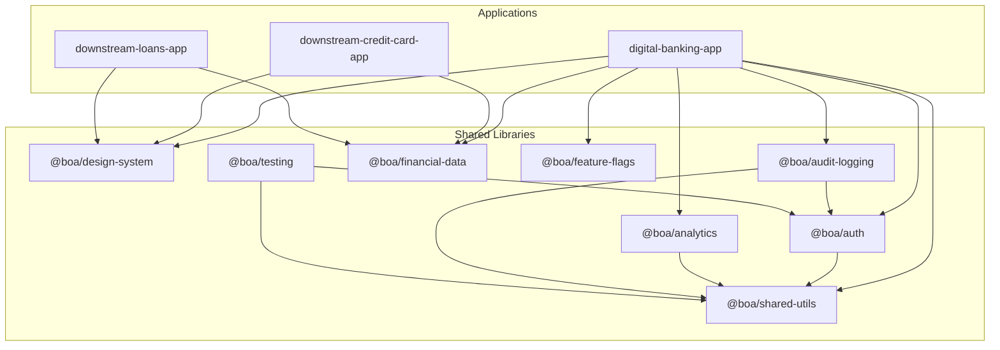
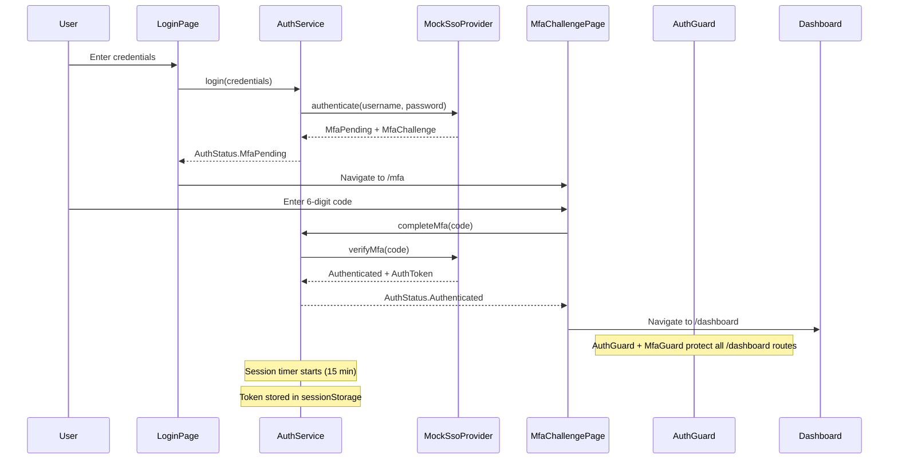
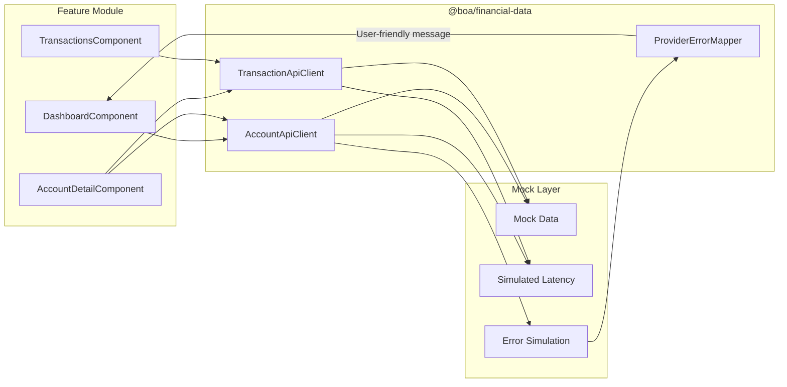
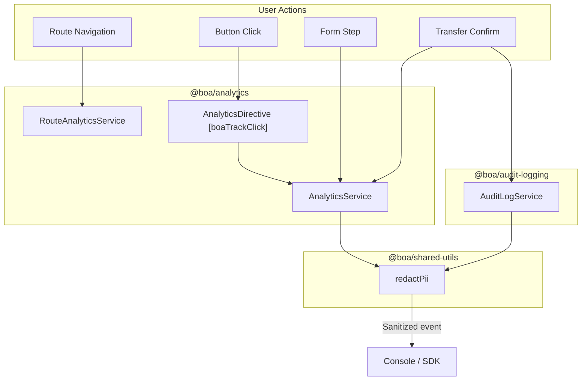

# Architecture Overview

## Purpose

This repository (`boa-angular`) is a pre-migration Angular 14 monorepo representing a Bank of America-style digital banking frontend. It serves as a realistic enterprise migration target, with enough complexity across authentication, shared UI components, financial data providers, analytics, audit logging, and downstream consumers to exercise every major risk surface during an Angular framework upgrade.

The codebase uses Angular 14 patterns throughout: NgModules, class-based route guards, `HttpInterceptor` implementations, Angular Material 14 (pre-MDC), and reactive forms.

---

## Monorepo Structure

```
boa-angular/
├── apps/
│   ├── digital-banking-app/          # Primary banking application
│   ├── downstream-credit-card-app/   # Credit card consumer app
│   └── downstream-loans-app/         # Loans consumer app
├── libs/
│   ├── auth/                         # Authentication, guards, interceptors
│   ├── analytics/                    # Analytics tracking services
│   ├── audit-logging/                # Compliance audit logging
│   ├── boa-design-system/            # Shared UI component library
│   ├── feature-flags/                # Feature flag system
│   ├── financial-data/               # Mock financial API clients
│   ├── shared-utils/                 # Formatting, masking, error utilities
│   └── testing/                      # Shared test helpers
├── cypress/                          # E2E smoke tests
├── docs/                             # Documentation
└── scripts/                          # Build validation scripts
```

### Dependency Graph



---

## Applications

### digital-banking-app

The primary application. Serves the full authenticated banking experience including login, MFA, account dashboard, transactions, transfers, bill pay, and profile management.

| Property | Value |
|----------|-------|
| Path | `apps/digital-banking-app/` |
| Prefix | `boa` |
| Dev port | 4200 |
| Builder | `@angular-devkit/build-angular:browser` |

**Feature modules** (all lazy-loaded):
- **Dashboard** -- account summary cards, total balance, recent transactions
- **Account Detail** -- transaction table with filters, CSV export
- **Transactions** -- full search, date/category/type filters, detail dialog
- **Transfer** -- 6-step stepper flow with audit logging
- **Bill Pay** -- payee management, scheduled payments
- **Profile & Security** -- MFA methods, login activity, trusted devices

**App shell components:**
- `LayoutModule` with responsive header, sidenav, session timer, alert container
- `PublicModule` with login, MFA challenge, session expired, and maintenance pages

### downstream-credit-card-app

A small single-page app that consumes the shared design system and financial data libraries. Displays a credit card account summary with transaction history, credit utilization, and a payment-due alert banner.

| Property | Value |
|----------|-------|
| Path | `apps/downstream-credit-card-app/` |
| Prefix | `boa-cc` |
| Dev port | 4201 |

Uses 5 shared components: `AccountCardComponent`, `MoneyDisplayComponent`, `DataTableComponent`, `AlertBannerComponent`, `LoadingSkeletonComponent`.

### downstream-loans-app

A small single-page app showing a loan account summary with a 12-month amortization schedule, principal/interest breakdown, and autopay enrollment banner.

| Property | Value |
|----------|-------|
| Path | `apps/downstream-loans-app/` |
| Prefix | `boa-loans` |
| Dev port | 4202 |

Uses 6 shared components: `AccountCardComponent`, `MoneyDisplayComponent`, `DataTableComponent`, `AlertBannerComponent`, `LoadingSkeletonComponent`, `EmptyStateComponent`.

---

## Shared Libraries

### @boa/design-system (`libs/boa-design-system/`)

The central shared UI library. Wraps Angular Material 14 components with Bank of America branding and exposes a consistent component API consumed by all three applications.

**SCSS Foundation:**
- `_variables.scss` -- BoA navy (#012169), red (#E31837), grays, spacing, elevation, breakpoints
- `_typography.scss` -- custom `mat-typography-config`
- `_theme.scss` -- pre-MDC API: `mat-core`, `mat-palette`, `mat-light-theme`, `angular-material-theme`
- `_mixins.scss` -- responsive helpers, elevation, focus ring, card base

**Components (12):**

| Component | Purpose |
|-----------|---------|
| `BoaButtonComponent` | Primary/secondary/tertiary button with loading and icon support |
| `AccountCardComponent` | Account name, masked number, balance, status badge |
| `MoneyDisplayComponent` | Currency formatting, negatives, masked, compact display |
| `AlertBannerComponent` | Info/warning/error/success with ARIA `role="alert"` |
| `DataTableComponent` | Wraps MatTable with sort, pagination, loading/empty states |
| `DialogWrapperComponent` | Wraps MatDialog with header/body/footer |
| `FormFieldComponent` | Wraps MatFormField with validation, currency, masked input |
| `LoadingSkeletonComponent` | Card/table/text skeleton variants with shimmer animation |
| `EmptyStateComponent` | Icon, title, body, optional CTA |
| `StepperComponent` | Wraps MatStepper with linear mode and BoA styling |
| `GlobalHeaderComponent` | Logo, hamburger, search, notifications, user menu |
| `SideNavComponent` | Navigation list with collapsed icons-only mode |

### @boa/auth (`libs/auth/`)

Handles authentication state, mock SSO/MFA flows, route protection, and HTTP request enrichment.

**Services:**
- `AuthService` -- login, completeMfa, logout, refreshSession, `authState$` observable, session expiration timer, token storage in sessionStorage
- `MockSsoProvider` -- simulates SSO with delays, MFA challenge, lockout after 3 attempts

**Guards (class-based, Angular 14 pattern):**
- `AuthGuard` -- redirects to `/login` or `/mfa` if not authenticated
- `MfaGuard` -- ensures MFA is complete before accessing protected routes
- `RoleGuard` -- checks route data roles against user profile

**Interceptors:**
- `AuthTokenInterceptor` -- attaches Bearer token, skips public endpoints
- `CorrelationIdInterceptor` -- adds `X-Correlation-ID` header to every request
- `ErrorHandlingInterceptor` -- maps 401/403/503 to navigation actions, normalizes errors
- `SessionTimeoutInterceptor` -- refreshes session timer on successful responses

### @boa/analytics (`libs/analytics/`)

Proprietary analytics wrapper that tracks user behavior while redacting PII.

- `AnalyticsService` -- trackPageView, trackButtonClick, trackFormStep, trackError, trackCompletedTransfer, trackCompletedBillPay
- `RouteAnalyticsService` -- subscribes to Angular Router `NavigationEnd` events, strips query params, tracks previous route
- `AnalyticsDirective` -- `[boaTrackClick]` attribute directive for declarative click tracking

All events include correlationId, userSegment, and timestamp. Sensitive fields are redacted via `redactPii` from `@boa/shared-utils`.

### @boa/audit-logging (`libs/audit-logging/`)

Compliance-grade structured logging for security-sensitive operations.

- `AuditLogService` -- logLoginAttempt, logMfaResult, logTransferReview, logTransferConfirmation, logBillPayConfirmation, logProfileSecurityChange, logExportTransactions, logLogout, logSessionExpired

Every event includes: correlationId, userId, ISO 8601 timestamp, severity level (Info/Warning/Critical). All metadata passes through `redactPii()` before emission. Gated by `auditLoggingEnabled` environment config.

**Event types:** LoginAttempt, MfaResult, TransferReview, TransferConfirmation, BillPayConfirmation, ProfileSecurityChange, ExportTransactions, Logout, SessionExpired, SecurityAlert.

### @boa/financial-data (`libs/financial-data/`)

Mock financial data provider clients with simulated latency and error conditions.

**API Clients:**
- `AccountApiClient` -- getAccounts, getAccountById, getBalance (200-800ms simulated latency)
- `TransactionApiClient` -- getTransactions with date/category/amount filtering, CSV export
- `TransferApiClient` -- validateTransfer, submitTransfer with insufficient funds/timeout simulation
- `BillPayApiClient` -- getPayees, addPayee, submitPayment

**Error Simulation:**
- `ProviderErrorMapper` -- maps 13 provider error codes to user-friendly messages
- Account `ERROR-001` triggers provider timeout
- Transfer amount `99999` triggers insufficient funds
- Transfer amount `88888` triggers timeout

**Mock Data:** 5 accounts (checking, savings, money market, credit card, auto loan), 28 transactions, 8 payees.

### @boa/feature-flags (`libs/feature-flags/`)

Simple feature flag system for incremental rollout control.

- `FeatureFlagService` -- BehaviorSubject-based flag state, `isEnabled(flag)` returns Observable
- `FeatureFlagDirective` -- `*boaFeatureFlag` structural directive with else template support

**Default flags (8):** new-transfer-flow, new-dashboard-card, provider-fallback, enhanced-analytics, dark-mode, biometric-auth, real-time-notifications, angular18-migrated-behavior.

### @boa/shared-utils (`libs/shared-utils/`)

Cross-cutting utility functions used by multiple libraries and applications.

| Category | Exports |
|----------|---------|
| Currency | `formatCurrency`, `parseCurrency` (locale-aware, compact $1.2K, masked) |
| Dates | `formatDate`, `formatRelativeDate`, `parseISODate`, `isValidDateRange` |
| Account masking | `maskAccountNumber`, `maskRoutingNumber`, `maskCreditCardNumber`, `getLastFourDigits` |
| PII redaction | `redactEmail`, `redactPhone`, `redactSsn`, `redactPii` (recursive detection) |
| Identifiers | `generateCorrelationId`, `isValidCorrelationId` |
| Errors | `normalizeError`, `isNetworkError`, `isHttpError` |
| Config | `EnvironmentConfigService` (injectable config with apiBaseUrl, sessionTimeout, etc.) |

### @boa/testing (`libs/testing/`)

Shared test helpers used across unit and integration tests.

- `createMockAuthService` -- mock AuthService with controllable observables
- `createMockRouter` -- mock Angular Router
- `createMockEnvironmentConfigService` -- mock environment config

---

## Key Flows

### Authentication Flow



### Financial Data Provider Flow



### Analytics and Audit Logging Flow



---

## Downstream Consumer Model

The downstream apps (`downstream-credit-card-app`, `downstream-loans-app`) exist to validate that changes to the shared design system library do not break other teams. They import `BoaDesignSystemModule` and `FinancialDataModule` directly and use shared components without copying or wrapping them.

Any migration of `@boa/design-system` must pass the downstream build validation:

```bash
npm run validate:builds
# Builds all 3 apps sequentially; exits non-zero on first failure
```

This ensures that Angular Material upgrades, component API changes, or SCSS theme modifications are caught before they reach downstream consumers.

---

## Testing Strategy

| Layer | Tool | Count | Scope |
|-------|------|-------|-------|
| Unit tests | Karma / Jasmine | 36 | Auth, design system components, utilities, validators |
| Integration tests | Karma / Jasmine | 22 | Multi-service flows (login->MFA, dashboard loading, analytics, audit) |
| E2E smoke tests | Cypress | 3 | Login/MFA/dashboard, account/transactions, transfer flow |
| Build validation | Shell script | 3 apps | All apps compile with `--configuration=production` |

Total: 58 automated tests across unit, integration, and build validation layers.
